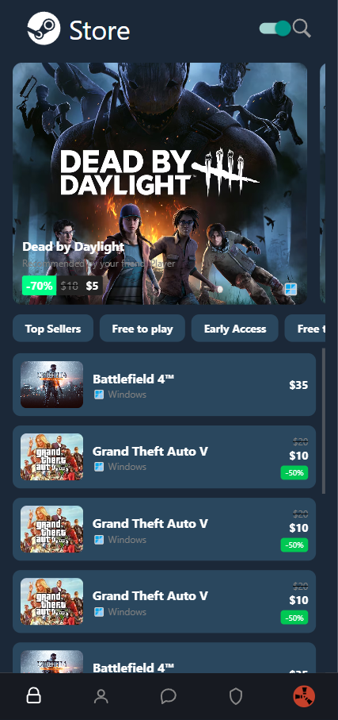
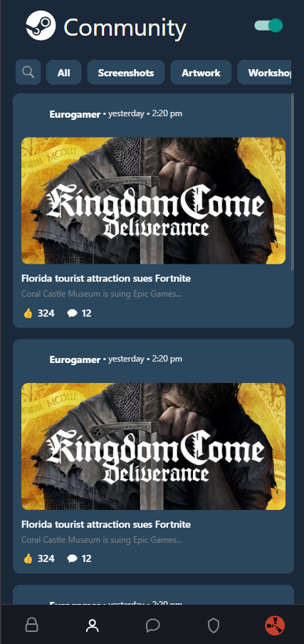
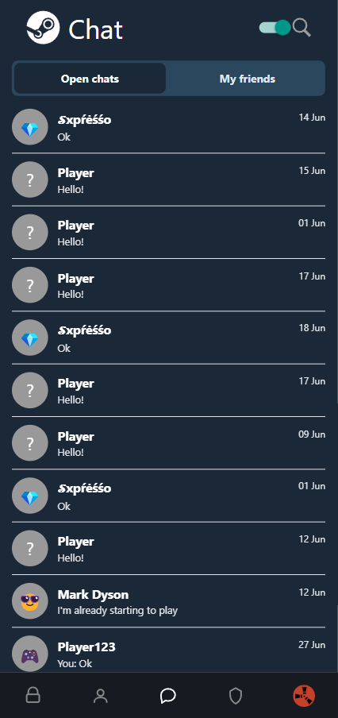
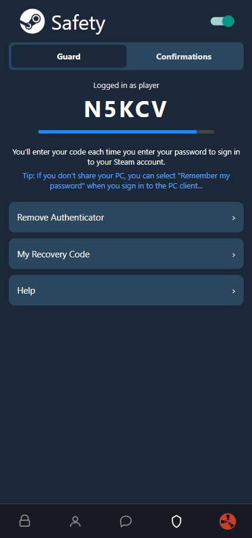
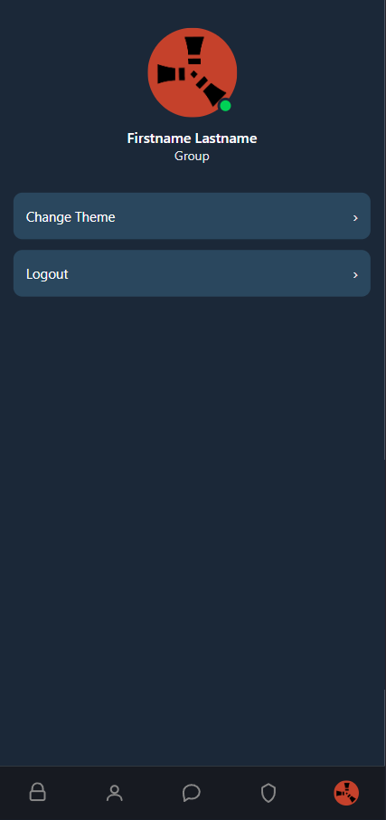

# Steam-style Mobile App – Lab 2

Лабораторна робота №2  
**Тема:** Стилізація компонентів у React Native, списки, темізація.

---

## Установка та запуск
! Потрібен Expo CLI (npm install -g expo-cli)
```bash
git clone https://github.com/ipz234gdi/MobileLabsRN2025/tree/lab-2
cd Lab-2
npm install
npx expo start
```

# Темізація
Підтримується світла та темна тема, перемикання через Switch на екрані Profile.

```bash
// themes/index.js
export const lightTheme = {
  background: "#FFFFFF",
  nav: "#F0F0F0",
  text: "#000000",
  card: "#F0F0F0",
  gray: "#666666"
};

export const darkTheme = {
  background: "#1B2838",
  nav: "#171a21",
  text: "#FFFFFF",
  card: "#2A475E",
  gray: "#AAAAAA"
};
```
```bash
// theme/ThemeProvider.js
import React, { createContext, useState } from "react";
import { ThemeProvider as StyledProvider } from "styled-components/native";
import { darkTheme, lightTheme } from "./index";

export const ThemeToggleContext = createContext();

export default function ThemeProvider({ children }) {
  const [isDark, setIsDark] = useState(true);
  const toggleTheme = () => setIsDark(!isDark);

  return (
    <ThemeToggleContext.Provider value={{ isDark, toggleTheme }}>
      <StyledProvider theme={isDark ? darkTheme : lightTheme}>
        {children}
      </StyledProvider>
    </ThemeToggleContext.Provider>
  );
}
```

# Навігація
Здійснюється через React Navigation (@react-navigation/native) + createBottomTabNavigator.
Усі екрани знаходяться в screens/, іконки — SVG.

## Екрани застосунку
### Store
FlatList зі списком ігор

Банери

Таб-фільтри

Infinite scroll

[Store.js](./screens/Store.js)  


### Community
Список новин у картках

Пошук і вкладки новин

[Community.js](./screens/Community.js)  


### Chat
Список діалогів

Вкладки: Open / My Friends

[Chat.js](./screens/Chat.js)  



### Safety
Вкладки: Guard / Confirmations

Steam Guard код + прогрес-бар

[Safety.js](./screens/Safety.js)  



### Profile
Ім’я, група, аватар

Перемикач теми (Switch)

Кнопки: Change Theme / Logout

[Profile.js](./screens/Profile.js)  


## Автор
Ім’я: Грушевицький Денис

Група: IPZ-23-4

ЛР №2 — React Native, Expo, styled-components